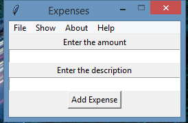
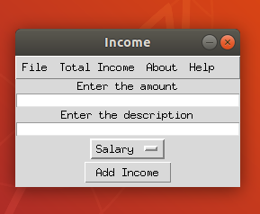
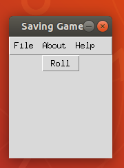

# my financial

 

# Table of contents

<!--ts-->
  * [my financial](#my_financial)
  * [Table of contents](#Table_of_contents)
  * [Files](#Files)
  * [Dependencies](#Dependencies)
  * [Expenses](#Expenses)
    * [Expenses_Current_Version](#Expenses_Current_Version)
    * [Expenses_Radon](#Expenses_Radon)
    * [Expenses_Keybinds](#Expenses_Keybinds)
  * [Emergency_fund](#Emergency_fund)
    * [Emergency_fund_Current_Version](#Emergency_fund_Current_Version)
    * [Emergency_fund_Keybinds](#Emergency_fund_Keybinds)
  * [Income](#Income)
    * [Income_Current_Version](#Income_Current_Version)
    * [Income_Radon](#Income_Radon)
    * [Income_Keybinds](#Income_Keybinds)
  * [Saving_game](#Saving_game)
    * [Saving_game_Current_Version](#Saving_game_Current_Version)
    * [Saving_game_Keybinds](#Saving_game_Keybinds)
  * [License](#License)
<!--te-->

## Files
<ul>
 <li> Emenrgency_fundkeybinds.txt(.txt keybinds file for Emenrgency_funds) </li> 
 <li> Expenses keybinds.txt(.txt keybinds file fir expenses) </li>
 <li> Income.py(income main) </li>
 <li> Saving_Game.csv(.csv file of saving game) </li>
 <li> expenses.py(expenses main) </li>
 <li> imf.py(emenrgency main) </li>
 <li> income keybinds.txt(.txt keybinds file for income) </li>
 <li> myexpp2.py(expenses main update) </li>
 <li> saving game keybinds.txt(.txt keybinds for saving game) </li>
 <li> saving game.py(saving game main) </li>
</ul>

## Dependencies

<ul>
  <li> matplotlib (conda install -c conda-forge matplotlib) </li>
  <li> second way to install matplotlib (pip install matplotlib) </li>
  <li> pandas (conda install -c anaconda pandas) </li>
  <li> second way to install pandas( pip install pandas) </li>
  <li> csv (conda install -c anaconda csvkit) </li>
  <li> second way to install csv ( pip install python-csv) </li>
</ul>

## Expenses

 You can keep track of your expenses 

## Expenses_Current_Version

 

## Expenses_Radon

 

 

 

 

## Expenses_Keybinds 

 <ul>
  <li> Add Expense(Ctrl+T) </li>
  <li> Exit(Alt+F4) </li>
  <li> Clear Amount(Ctrl+Z) </li>
  <li> Clear Description(Alt+Z) </li>
  <li> Bar Chart(Ctrl+B) </li>
  <li> Pie Chart(Ctrl+P) </li>
  <li> Show Monthly Other(Alt+O) </li>
  <li> Show Monthly Transportation(Alt+T) </li>
  <li> Show Monthly Grocery(Alt+G) </li>
  <li> Show Monthly Bills/Taxes(Alt+B) </li>
  <li> Monthly Expenses(Ctrl+S) </li>
  <li> Abput(Ctrl+I) </li>
  <li> Help(Ctrl+F1) </li>
</ul>

## Emergency_fund

 You can create an emergency fund plan  

 ## Emergency_fund_Current_Version

 

## Emergency_fund_Radon

 

 

## Emergency_fund_Keybinds

 <ul>
  <li> Plan an Emergency Fund(Ctrl+P) </li>
  <li> Exit(Alt+F4) </li>
  <li> Show Plans(Alt+P) </li>
  <li> Abput(Ctrl+I) </li>
  <li> Help(Ctrl+F1) </li>
</ul>

 ## Income 
 
 
 You can keep track of your income 

 
 ## Income_Current_Version

 

## Income_Radon

 

 

## Income_Keybinds

<ul>
  <li> Add Income(Ctrl+O) </li>
  <li> Exit(Alt+F4) </li>
  <li> Clear Amount(Ctrl+Z) </li>
  <li> Clear Description(Alt+Z) </li>
  <li> Show Bar chart(Ctrl+B) </li>
  <li> Show Pie chart(Ctrl+P) </li>
  <li> Monthly Salary(Alt+S) </li>
  <li> Monthly Other(Alt+O) </li>
  <li> Monthly Income(Alt+M) </li>
  <li> Abput(Ctrl+I) </li>
  <li> Help(Ctrl+F1) </li>
</ul>

## Saving_game

 A simple saving game 

 ## Saving_game_Current_Version

  

## Saving_game_Keybinds

<ul>
  <li> Roll (Alt+S) </li>
  <li> Exit (Alt+F4) </li>
  <li> About (Ctrl+I) </li>
  <li> Help (Ctrl+F1) </li>
</ul>

## License

[GNU GPLv3](https://choosealicense.com/licenses/gpl-3.0/)